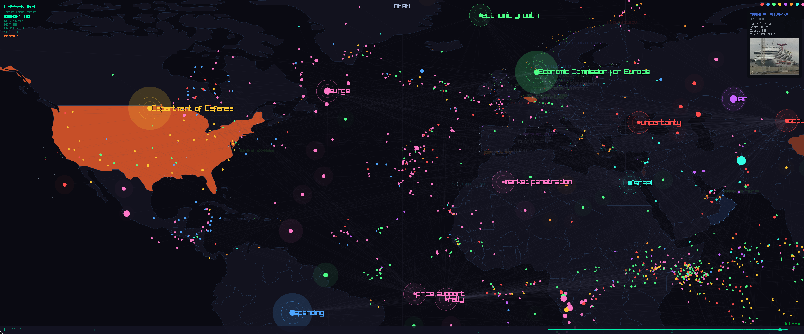

# CASSANDRA

A live map of what the internet is talking about.



The system continuously reads news feeds, groups the words it finds into clusters of related concepts, and plots them on an interactive 2D map. Topics that are trending glow brighter; topics the internet has moved on from fade out. Related concepts drift closer together, giving you a weather-radar view of the news cycle at a glance.

Live overlays track real-world movement on the same map — ships via AIS and aircraft via ADS-B, with a plugin system for adding more data sources. More overlays are on the way.

## Architecture

```
RSS feeds ──► hourly.py (ingest) ──► nucleus.db (SQLite)
                                         │
                                         ▼
                                   viewer (Zig + Raylib)
```

- **`hourly.py`** — Fetches RSS headlines, tokenizes them, updates the nucleus model, writes snapshots and positions to SQLite.
- **`prototype.py`** — Core model: `ConceptNucleus`, `WordNetNucleusModel`, GloVe embedding loader.
- **`db.py`** — SQLite helpers (schema, snapshot storage, position I/O).
- **`viewer/`** — Real-time interactive viewer built with Zig and Raylib.
- **`render.py`** — Batch matplotlib renderer (reads saved JSON, outputs frames).
- **`make_movie.py`** — Stitches `frames/` into an MP4 via ffmpeg.

## Prerequisites

- Python 3.11+
- [Zig](https://ziglang.org/download/) (0.14+)
- [Raylib](https://www.raylib.com/) (system library)
- GloVe embeddings (see below)

### Zig

Download a prebuilt binary from [ziglang.org/download](https://ziglang.org/download/) and add it to your `PATH`, or use your package manager:

```bash
# Arch
sudo pacman -S zig

# macOS
brew install zig

# Ubuntu/Debian (via snap)
sudo snap install zig --classic --beta
```

### Raylib

Raylib needs to be installed as a system library so the Zig build can link against it:

```bash
# Arch
sudo pacman -S raylib

# macOS
brew install raylib

# Ubuntu/Debian
sudo apt install libraylib-dev

# From source (any platform)
git clone https://github.com/raysan5/raylib.git
cd raylib/src && make PLATFORM=PLATFORM_DESKTOP && sudo make install
```

### GloVe embeddings

```bash
mkdir -p data
curl -Lo data/glove.6B.zip https://nlp.stanford.edu/data/glove.6B.zip
unzip data/glove.6B.zip glove.6B.50d.txt -d data/
rm data/glove.6B.zip
```

### Python dependencies

```bash
python -m venv .venv
source .venv/bin/activate
pip install numpy scipy scikit-learn feedparser nltk matplotlib pillow
```

## Running

### Configuring feeds

Feeds are defined in `feeds.json`. Each entry has a `name` and an RSS `url`:

```json
[
  {"name": "Economy (US)", "url": "https://news.google.com/rss/search?q=recession+OR+%22economic+slowdown%22&hl=en-US&gl=US&ceid=US:en"},
  {"name": "TechCrunch",  "url": "https://techcrunch.com/feed/"}
]
```

Any valid RSS or Atom feed URL will work. You can build custom Google News feeds by changing the search query:

```
https://news.google.com/rss/search?q=Taylor+Swift+OR+Beyonce&hl=en-US&gl=US&ceid=US:en
```

Some ideas:
- **Local news** — search for your city or region (`q=Portland+Oregon`)
- **Celebrities** — track names or entertainment topics
- **Industry-specific** — `q=biotech+OR+%22clinical+trials%22` for pharma, etc.
- **Non-English** — change `hl=` and `gl=` params (e.g. `hl=de&gl=DE&ceid=DE:de` for German news)
- **Any RSS feed** — blogs, subreddits (`https://www.reddit.com/r/worldnews/.rss`), government feeds, etc.

Changes take effect on the next ingest restart.

### 1. Ingest

```bash
python ingest_live.py
```

This runs continuously, round-robining through RSS feeds and drip-feeding headlines in small batches (default: 10 headlines every 6 seconds). A full cycle through all feeds takes about 6 minutes.

```bash
python ingest_live.py --interval 3 --batch 5   # faster, for testing
```

To run it as a background service with systemd (user):

```bash
cp wordnet-live.service ~/.config/systemd/user/
systemctl --user enable --now wordnet-live.service
```

### 2. Viewer

```bash
cd viewer
zig build run
```

The viewer reads from `nucleus.db` in real time. It polls for new snapshots on a background thread, so you can leave it running while `hourly.py` adds data.

### 3. Overlays (ships & planes)

The viewer has live overlays toggled with keyboard shortcuts:

| Key | Overlay | Source |
|-----|---------|--------|
| `S` | Ships (AIS) | Digitraffic (Finland) by default |
| `A` | Aircraft (ADS-B) | OpenSky Network |

For **global ship coverage**, set an [aisstream.io](https://aisstream.io) API key:

```bash
export AISSTREAM_API_KEY=your_key_here
```

Without it, ship data is limited to the Finnish coast via the free Digitraffic API.

### 4. Batch rendering (optional)

```bash
python render.py          # renders frames to frames/
python make_movie.py      # stitches into concept_timelapse.mp4
```

## Viewer controls

### General

| Key | Action |
|-----|--------|
| `F` / `F11` | Toggle fullscreen |
| `Home` | Reset camera (fit to screen) |
| `Esc` | Close search / clear selection |
| `P` | Toggle performance stats |

### Search

| Key | Action |
|-----|--------|
| `/` | Open search bar |
| `Esc` | Close search bar |

### Navigation & display

| Key | Action |
|-----|--------|
| `G` | Toggle physics simulation |
| `M` | Toggle geographic mode (pins concepts to map coordinates) |
| `;` / `'` | Decrease / increase geo spring strength |
| `N` | Toggle navmesh visualisation |
| `E` | Toggle edge rendering |
| `1`–`8` | Toggle visibility of colour clusters |

### Timeline

| Key | Action |
|-----|--------|
| `Space` | Play / pause timeline |
| `[` / `]` | Decrease / increase playback speed |
| `Left` / `Right` | Step backward / forward |
| `End` | Snap to live |

### Visual effects

| Key | Action |
|-----|--------|
| `T` | Toggle motion trails |
| `B` | Toggle bloom |

### Overlays

| Key | Action |
|-----|--------|
| `S` | Toggle ships (AIS) |
| `A` | Toggle aircraft (ADS-B) |

## Like what you see?

If you find CASSANDRA interesting, please give it a star and share it with others — it really helps the project grow.

## License

See [LICENSE](LICENSE).
