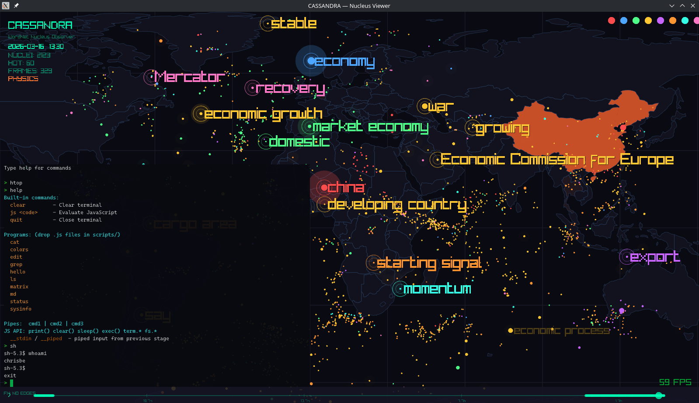
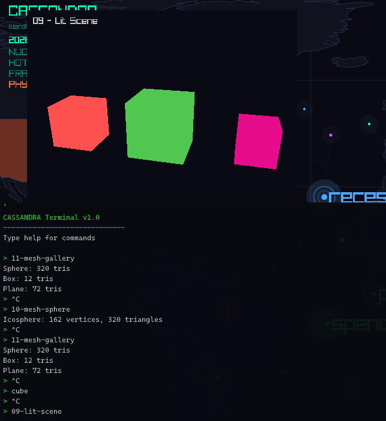
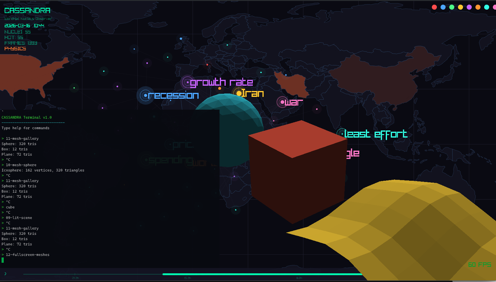

# CASSANDRA Terminal

CASSANDRA includes a built-in terminal emulator and JavaScript-powered operating system. Press **backtick** (`` ` ``) to toggle.


## Overview

The terminal is a full VT100/ANSI-compatible emulator with a programmable shell written entirely in JavaScript. It supports:

- ANSI escape sequences (colors, cursor movement, erase, scroll)
- 256-color and truecolor (24-bit) output
- Unicode text rendering (Cascadia Mono / DejaVu Sans Mono)
- Double-buffered cell grid with dirty-row tracking
- 5000-line scrollback buffer (mouse wheel to scroll)
- Alternate screen buffer (for TUI programs)
- Clipboard paste (Ctrl+V, Shift+Insert)

## The Shell

The shell (`scripts/shell.js`) is a JavaScript program. It handles command parsing, pipes, script discovery, and falls back to host system binaries. Everything is customisable.

### Built-in commands

| Command | Action |
|---------|--------|
| `help` | Show available commands and programs |
| `clear` | Clear the terminal |
| `js <code>` | Evaluate inline JavaScript |
| `quit` / `exit` | Close the terminal |

### Programs

Any `.js` file in the `scripts/` directory is automatically available as a command. Type the filename without the extension to run it.

| Program | Description |
|---------|-------------|
| `ls [path]` | List files in a directory |
| `cat <file>` | Display file contents |
| `edit <file>` | Nano-like text editor (Ctrl+S save, Ctrl+X quit) |
| `md <file>` | Render markdown with ANSI formatting |
| `grep <pattern> [file]` | Search with highlighted matches |
| `hello` | Welcome banner and color test |
| `status` | System status |
| `colors` | 256-color palette display |
| `matrix` | Matrix rain animation |
| `sysinfo` | System information panel |

### Pipes

Commands can be chained with pipes, just like Unix:

```
cat ../README.md | md
cat ../feeds.json | grep Economy
ls ../scripts | grep edit
```

Output from each stage flows into `__stdin` for the next. All output (including `term.write()`) is captured at the native level.

### Host System Binaries

If a command isn't a built-in or a `.js` script, it runs as a host system binary with a full PTY (pseudo-terminal). This means interactive programs work:

```
htop
vi somefile.txt
ssh user@host
curl wttr.in/London
python3 -c "print('hello')"
```

The host program's ANSI output is rendered by CASSANDRA's terminal emulator, so colors, cursor movement, and TUI layouts all work.

## Writing Programs

Drop a `.js` file in `scripts/` and it's immediately available. No compilation, no restart.

### JavaScript API

**Output:**
- `print(...)` — print to terminal with newline
- `clear()` — clear screen
- `term.write(s)` — raw write (supports ANSI escape sequences)
- `term.cursor(row, col)` — move cursor
- `term.color(name)` — set color by name (`red`, `green`, `cyan`, `yellow`, `blue`, `magenta`, `white`)
- `term.color("38;5;196")` — raw ANSI color code
- `term.reset()` — reset all attributes
- `term.cols` / `term.rows` — terminal dimensions

**Input:**
- `term.readLine()` — buffered line input with editing, history (up/down), and cursor movement (left/right, Ctrl+A/E, Ctrl+Left/Right word jump)
- `term.rawMode(1/0)` — enable/disable raw key input
- `term.getKey()` — blocking read of a single key (returns `"a"`, `"enter"`, `"up"`, `"ctrl-s"`, etc.)

**Filesystem:**
- `fs.readFile(path)` — read file contents as string (or null)
- `fs.writeFile(path, content)` — write string to file (returns true/false)
- `fs.listDir(path)` — list directory entries as array (or null)
- `fs.exists(path)` — check if file exists

**Execution:**
- `exec(path)` — run a `.js` file in its own scope
- `exec(path, true)` — run and capture all output, returns string
- `system(cmd)` — run a host binary with PTY (interactive)
- `sleep(ms)` — pause execution

**Piped input:**
- `__stdin` — string containing piped input from previous command
- `__piped` — boolean, true if receiving piped data
- `__args` — string containing command arguments

### Example: Hello World

```javascript
// scripts/hello.js
term.color("green");
print("Hello from CASSANDRA OS!");
term.reset();
print("Terminal: " + term.cols + "x" + term.rows);
print("Date: " + new Date().toISOString());
```

### Example: Interactive Program

```javascript
// scripts/ask.js
term.color("cyan");
term.write("What is your name? ");
term.reset();
const name = term.readLine();
print("Hello, " + name + "!");
```

### Example: Filter (for pipes)

```javascript
// scripts/upper.js — uppercases piped input
if (__piped && __stdin) {
    print(__stdin.toUpperCase());
} else {
    print("Usage: cat file | upper");
}
```

### Example: Raw Key Input

```javascript
// scripts/keytest.js
term.rawMode(1);
print("Press keys (ESC to quit):");
while (true) {
    const key = term.getKey();
    if (key === "escape") break;
    print("Key: " + key);
}
term.rawMode(0);
```

## Architecture

```
Keyboard ──> Terminal (Zig)
                │
                ├── Raw key queue ──> JS Worker Thread
                │                        │
                │                    QuickJS Engine
                │                        │
                │                    ┌────┴────┐
                │                    │ shell.js │
                │                    │ *.js     │
                │                    │ system() │──> PTY ──> Host Process
                │                    └────┬────┘
                │                         │
                └── Output queue <────────┘
                        │
                    Cell Grid (double-buffered)
                        │
                    RenderTexture ──> Screen
```

- **Terminal** (`viewer/src/terminal.zig`) — VT100 cell grid, ANSI parser, rendering, input handling
- **Parser** (`viewer/src/terminal_parser.zig`) — ANSI escape sequence state machine, SGR, CSI dispatch
- **JS Runtime** (`viewer/src/js.zig`) — QuickJS on worker thread, output queue, capture mode, PTY, readline
- **Shell** (`scripts/shell.js`) — command interpreter, pipes, script discovery
- **Programs** (`scripts/*.js`) — user-extensible JavaScript programs



## Graphics API

JavaScript programs can draw 2D and 3D graphics directly to the screen. Commands flow through a ring buffer from the JS worker thread to the GPU — like a DMA controller.

### 2D Drawing

```javascript
gfx.create(0, 400, 400);     // create display 0, 400x400
gfx.move(0, 50, 50);         // position on screen
let t = 0;
while (true) {
    gfx.begin(0);
    gfx.clear(10, 10, 20);   // dark background
    gfx.rect(50, 50, 100, 80, gfx.rgb(255, 0, 0));
    gfx.circle(200, 200, 40, gfx.rgb(0, 255, 100));
    gfx.triangle(300, 100, 350, 200, 250, 200, gfx.rgb(0, 100, 255));
    gfx.text(10, 10, "Hello", 20, gfx.rgb(255, 255, 255));
    gfx.end(0);
    sleep(16);
}
```

### 3D Rendering (GPU)

3D uses Raylib's real GPU pipeline — proper depth buffer, backface culling, perspective projection:

```javascript
gfx.create(0, 400, 400);
let t = 0;
while (true) {
    gfx.begin(0);
    gfx.clear(15, 15, 25);
    gfx.text(10, 10, "Solid Cube", 16, gfx.rgb(200, 200, 200));

    // 3D mode: orbiting camera
    const camX = Math.cos(t * 0.02) * 5;
    const camZ = Math.sin(t * 0.02) * 5;
    gfx.begin3d(camX, 3, camZ, 0, 0, 0, 45);
    gfx.solidCube(0, 0, 0, 2, gfx.rgb(50, 200, 100));
    gfx.cube(0, 0, 0, 2.02, gfx.rgb(100, 255, 150));  // wireframe outline
    gfx.end3d();

    gfx.end(0);
    t++;
    sleep(16);
}
```


### Scene Graph with Behaviors

The `scene.js` library provides retained-mode objects with composable behaviors:

```javascript
exec("../scripts/lib/scene.js");
const scene = new Scene(0, 400, 400);
scene.position(50, 30);

scene.cube({ solid: true, size: 1.5, color: gfx.rgb(50, 200, 100) })
    .behave("color-cycle");

scene.circle({ x: 200, y: 350, r: 20, color: gfx.rgb(255, 100, 50) })
    .behave("bounce");

scene.run();
```

Behaviors are `.js` files in `scripts/behaviors/`:

```javascript
// behaviors/bounce.js
function(obj, t, dt, opts) {
    obj.y = (obj.data._baseY || obj.y) + Math.sin(t * 3) * 0.5;
    if (!obj.data._baseY) obj.data._baseY = obj.y;
}
```

Built-in behaviors: `rotate`, `bounce`, `pulse`, `orbit`, `color-cycle`.


### Tutorials

7 progressive tutorials in `scripts/tutorial/`:

| Tutorial | Description |
|----------|-------------|
| `01-triangle` | Hello triangle |
| `02-colors` | Colored shapes (triangles, rects, circles) |
| `03-animation` | Inline behaviors (bouncing, spinning) |
| `04-composition` | Solar system with orbiting planets and moon |
| `05-3d-cubes` | 3D wireframe cube grid with camera orbit |
| `06-starfield` | Classic demoscene starfield effect |
| `07-particles` | Fire particle system with gravity and fade |
| `08-solid-cube` | GPU-rendered solid cube with depth buffer |
| `09-lit-scene` | Multiple solid cubes with behaviors |
| `10-mesh-sphere` | Icosphere from point cloud (320 triangles) |
| `11-mesh-gallery` | Sphere, box, and animated wave plane |
| `12-fullscreen-meshes` | Full viewport transparent meshes over the map |





### Graphics API Reference

**Display lifecycle:**
- `gfx.create(id, w, h)` — create display (0-3)
- `gfx.destroy(id)` — free display
- `gfx.move(id, x, y)` — position on screen

**Frame:**
- `gfx.begin(id)` / `gfx.end(id)` — frame boundaries
- `gfx.clear(r, g, b)` — clear with color (omit for transparent)

**2D primitives:**
- `gfx.line(x1, y1, x2, y2, color, thick?)`
- `gfx.rect(x, y, w, h, color)`
- `gfx.rectLines(x, y, w, h, color, thick?)`
- `gfx.circle(cx, cy, r, color)`
- `gfx.triangle(x1, y1, x2, y2, x3, y3, color)`
- `gfx.text(x, y, str, size?, color?)`
- `gfx.pixel(x, y, color)`

**3D mode (GPU):**
- `gfx.begin3d(camX, camY, camZ, targetX, targetY, targetZ, fovy?)`
- `gfx.end3d()`
- `gfx.solidCube(x, y, z, size, color)`
- `gfx.cube(x, y, z, size, color)` — wireframe
- `gfx.triangle3d(x1,y1,z1, x2,y2,z2, x3,y3,z3, color)`
- `gfx.line3d(x1,y1,z1, x2,y2,z2, color)`

**Color helpers:**
- `gfx.rgb(r, g, b)` — returns packed color
- `gfx.rgba(r, g, b, a)` — with alpha

### Mesh Library

The `mesh.js` library generates 3D meshes with per-face lighting:

```javascript
exec("../scripts/lib/mesh.js");

const sphere = Mesh.icosphere(1.0, 2);  // radius, subdivisions (320 tris)
const box = Mesh.box(1, 1, 1);          // width, height, depth (12 tris)
const plane = Mesh.plane(4, 4, 8, 8);   // width, depth, segsW, segsD

// Draw inside begin3d/end3d
sphere.draw(x, y, z, color, [lightX, lightY, lightZ]);
```

Meshes compute per-vertex normals automatically and render with diffuse shading.

## Engine

The terminal is powered by [QuickJS](https://bellard.org/quickjs/) (2025-09-13), Fabrice Bellard's lightweight ES2023 JavaScript engine. It is compiled from source as part of the build (vendored in `viewer/vendor/quickjs/`).
